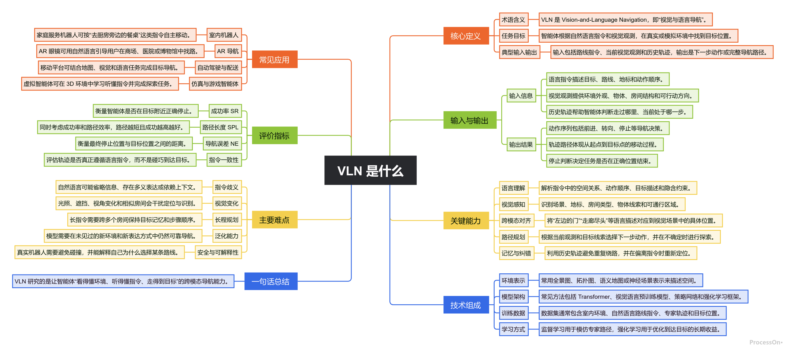

<!--
作者：算个文科生吧
联系方式(wx):RabbitRobot2025
Github:https://github.com/lijinghai
-->

# ljh_processon-mindmap-safe

一个用于 Codex 的 ProcessOn 思维导图 Skill。它可以把 Markdown 或自然语言内容提交到 ProcessOn 生成在线可编辑脑图，并专门规避 Windows / PowerShell 环境下中文被转成 `????` 的乱码问题。

> Skill 内部名称使用 `ljh-processon-mindmap-safe`，这是为了符合 Codex Skill 的命名规则；开源文件夹按你的要求使用 `ljh_` 前缀。

## 作者信息

- 作者：算个文科生吧
- 联系方式(wx)：RabbitRobot2025
- GitHub：https://github.com/lijinghai

## 为什么需要这个 Skill

在 Windows 上，如果直接把中文 Markdown 通过 PowerShell 管道传给脚本，例如：

```powershell
@'
# 中文标题
'@ | python scripts/processon_mindmap_client.py --markdown -
```

PowerShell 可能会用系统默认代码页传递标准输入，而不是 UTF-8。这样 ProcessOn API 收到的中文已经被破坏，最终脑图里就会出现大量 `????`。

这个 Skill 的解决方式是：**先把 Markdown 明确保存为 UTF-8 文件，再通过 `--markdown-file` 提交给 ProcessOn**。

## 功能

- 生成 ProcessOn 在线思维导图。
- 返回图片原始链接和在线编辑链接。
- 支持中文内容，不容易出现乱码。
- 支持多种 ProcessOn 图结构：思维导图、逻辑图、组织结构图、鱼骨图、时间轴、树形图、树形表格。
- 支持多种主题：现代活力、极简黑白、柔和雅韵、暗夜极光、浪漫治愈、复古单色。

## 安装方法

### 方法一：手动安装

1. 下载或复制本仓库中的 `ljh_processon-mindmap-safe` 文件夹。
2. 将整个文件夹放到 Codex 的 skills 目录。
3. 为了让文件夹名和 Skill 名称一致，建议安装时改名为 `ljh-processon-mindmap-safe`。

Windows：

```text
C:\Users\你的用户名\.codex\skills\ljh-processon-mindmap-safe
```

macOS / Linux：

```text
~/.codex/skills/ljh-processon-mindmap-safe
```

4. 重启 Codex。
5. 在 Codex 中输入类似下面的请求即可触发：

```text
使用 ljh-processon-mindmap-safe，帮我画一张中文思维导图，主题是 VLN 是什么。
```

### 方法二：从 GitHub 安装

如果仓库中保留 `ljh_processon-mindmap-safe` 这个子目录，可以让 Codex 从该路径安装。把下面命令里的仓库地址替换成你的真实仓库地址：

```text
请帮我安装这个 Codex Skill：https://github.com/lijinghai/你的仓库/tree/main/ljh_processon-mindmap-safe
```

如果仓库根目录就是这个 Skill 的内容，则可以说：

```text
请从 https://github.com/lijinghai/你的仓库 安装 ljh-processon-mindmap-safe 这个 Skill。
```

安装后同样需要重启 Codex。

## 使用示例

你可以直接对 Codex 说：

```text
使用 ljh-processon-mindmap-safe，帮我生成一张关于“多模态大模型是什么”的中文思维导图，要包含定义、核心能力、应用场景、技术难点和一句话总结。
```

Codex 会生成 Markdown，保存为 UTF-8 文件，然后调用脚本提交给 ProcessOn。最终会返回：

- Markdown 源内容
- 图片原始链接
- ProcessOn 在线编辑链接

## 手动调用脚本

如果你想绕过 Codex 手动测试，可以先准备一个 UTF-8 Markdown 文件，例如 `work/vln.md`：

```markdown
# VLN 是什么
## 定义
- VLN 是 Vision-and-Language Navigation，即视觉与语言导航。
## 关键能力
- 语言理解
- 视觉感知
- 跨模态对齐
- 路径规划
```

然后运行：

```powershell
python scripts/processon_mindmap_client.py --title "VLN 是什么" --theme "现代活力" --structure "mind_free" --markdown-file "work/vln.md"
```

注意：不要在 Windows PowerShell 中用管道传中文 Markdown，优先使用 `--markdown-file`。

## 支持的结构参数

| 参数 | 说明 | 适合场景 |
| --- | --- | --- |
| `mind_free` | 思维导图 / 中心放射 | 概念解释、知识框架、总结归纳、头脑风暴 |
| `mind_right` | 向右逻辑图 | 提纲、步骤、汇报框架、执行计划 |
| `mind_org` | 组织结构图 | 部门、岗位、层级、汇报关系 |
| `mind_ishikawa_left` | 鱼骨图 | 问题原因分析、复盘归因 |
| `mind_timeline_h` | 时间轴 | 阶段规划、里程碑、事件演进 |
| `mind_tree_free` | 树形图 | 项目任务拆解、WBS |
| `mind_treeTable_left_title` | 树形表格 | 参数清单、分类汇总、多方案对比 |

## 支持的主题

- 现代活力
- 极简黑白
- 柔和雅韵
- 暗夜极光
- 浪漫治愈
- 复古单色

## 示例效果

下面是开发时生成的 VLN 中文思维导图示例：



## 目录结构

```text
ljh_processon-mindmap-safe/
├── SKILL.md
├── README.md
├── .gitignore
├── agents/
│   └── openai.yaml
├── assets/
│   └── vln-example.png
└── scripts/
    ├── processon_mindmap_client.py
    └── theme_presets.json
```

## 开源前建议再补充什么

- `LICENSE`：建议明确开源协议，例如 MIT、Apache-2.0 或 GPL-3.0；没有 LICENSE 时，别人默认没有明确复用授权。本包暂未替你选择协议，避免替你做法律/授权决定。
- `.gitignore`：建议忽略缓存、临时文件、测试输出、系统文件，例如 `__pycache__/`、`.DS_Store`、`work/`。
- 仓库描述：建议在 GitHub About 中写清楚“ProcessOn 思维导图 Codex Skill，解决 Windows 中文乱码”。
- 示例截图：当前已包含 `assets/vln-example.png`，可以直接用于 README 展示。
- 隐私说明：提醒用户内容会提交到 ProcessOn 在线服务，不要上传敏感资料。

## 注意事项

- 本 Skill 会联网调用 ProcessOn 的 Markdown 转思维导图接口。
- 生成的在线编辑链接由 ProcessOn 返回，请妥善保存。
- 如果内容包含敏感信息，请先确认是否适合提交到第三方在线服务。
- 在 Windows 上处理中文时，请始终使用 UTF-8 Markdown 文件和 `--markdown-file`。
